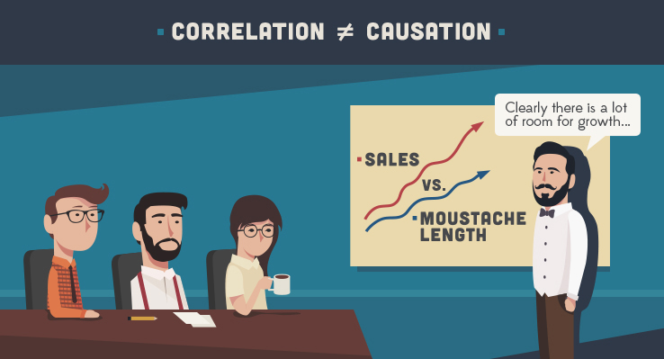
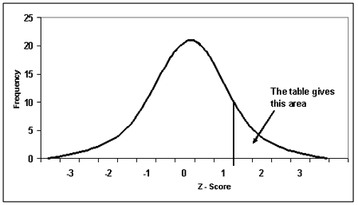
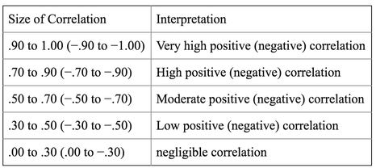

```{r setup, include=FALSE}
library(knitr)
library(rmdformats)
library(tidyverse)
library(kableExtra)

## Global options
options(max.print="75")
opts_chunk$set(echo=TRUE,
	             cache=TRUE,
               prompt=FALSE,
               tidy=TRUE,
               comment=NA,
               message=FALSE,
               warning=FALSE)
opts_knit$set(width=75)
```


\newpage


\newpage


## **Background**

In many situations, you may desire to examine the relationship between two or more numeric variables. Consider the following instances [@aiken2012multiple]. 

- What is the relationship between temperature and the sales of soft drinks (sodas)?
- What is the relationship between price of a product and the demand for that product?
- How does the weight of a book relate to its selling price?
- Can the hours a student spends in the library allow us to predict her/his examination performance? 
- In the photo above, what is the relationship between the age of a man (in years) and the amount of hair on his head (assume we could somehow count the individual `hairs`.)

These are some of the questions we shall tackle this week. We start by examining scatter plots, a simple but powerful tool for visualizing two numeric variables. Next, we shall look at the concept of correlation and learn how to compute the correlation coefficient which attempts to measure the strength of relationship between two numeric variables. Lastly, we shall discuss the concept of regression and learn how to develop a simple linear regression model. 

>***NB: Where you see tables and graphs, please click on the link `code` besides the table or graph to see the `R` code I used to generate each of them [@dearR].***

## **Objectives of the Lesson**

By the end of this lesson, you should be able to;

- Sketch a scatter plot for a set of data points. 
- Interpret a scatter plot.
- Compute the correlation coefficient.
- Interpret the value of the correlation coefficient.
- Describe the limitations of the correlation coefficient. 
- List and explain limitations of the correlation coefficient.

## **The Scatter Plot**

You are provided with the following data relating the outdoor temperature (in degrees celsius) and the number of people paying for swimming services at ABC hotel over 10 weekends. 

```{r}
week <- c("Week 1", "Week 2", "Week 3", "Week 4", "Week 5", "Week 6", "Week 7", "Week 8", "Week 9", "Week 10")

temperature <- seq(5, 30, length.out = 10) %>% round(2)

people <- seq(50, 150, length.out = 10) %>% round()

swim_data <- data.frame(week, temperature, people)

swim_data %>% 
  
  set_names(names(.) %>% str_to_upper()) %>% 
  
  knitr::kable(caption = "Relationship Between Temperature and Demand for Swimming Services") 
  
  
```

A scatter plot is a graphical representation of such data. In this case, we want to capture the link between temperature and people purchasing swimming services on an X-Y axis. Note that we could put any of the variables on either the X or Y axis, unless it is specifically stated which variable should be in each axis [@kuhn2020tidymodels]. 

### Perfect Positive Correlation

```{r}
swim_data %>% 
  
  ggplot(mapping = aes(x = temperature, y = people, col = week)) + 
  
  geom_point(shape = 1, size = 3, stroke = 2) + 
  
  ggthemes::theme_economist() + 
  
  labs(x = "Temperature", y = "People", title = "ABC Hotel", subtitle = "Temperature and Demand for Swimming Services") + 
  
  theme(legend.position = "none")
```

Note that there appears to be a direct relationship between temperature and the demand for swimming services. Apparently, people want to cool themselves when it is very hot. In this case, we say that demand for swimming services and temperature and positively correlated. Note that such correlation DOES NOT always imply causation. In other words, although there is a positive relationship between temperature and people buying swimming services, we cannot conclusively say that temperature causes a rise in swimming services unless we do additional analysis. Do not rush to assign causality based on correlation. In our case, there is a one to one correspondence between swimming and temperature and hence we have a rare situation of `perfect positive correlation`, positive because a rise in temperature accompanies an increase in the demand for swimming services. Notice how all the points lie in a straight line. 

This plot is an example of a scatterplot. It plots one quantitative variable against another. Just by looking at a scatterplot, you can see patterns, trends, relationships, and the occasional unusual cases standing apart from the general pattern. Scatterplots are the best way to start observing the relationship between two quantitative variables.

When evaluating scatter plots, we examine three matters;

- Look for Direction: If it is sloping upwards, then we have a positive relationship. The steeper the upward slope, the stronger the positive relationship. If it is sloping downwards, then we have a negative relationship. Again, the steeper the downward slope, the stronger the negative relationship. of course we have a case where you see neither positive nor negative relationship. This would be a case where the two variables are not correlated [@sharpe]. 

- Look for Form: Straight (linear), curved, something exotic, or no pattern?

- Look for Strength: How much scatter? If the points are on a straight line with no scatter, then we have a very strong correlation called perfect positive or negative correlation depending on the direction. Where the points are too scattered, we have weak correlation. 

- Look for Unusual Features: Are there unusual observations or subgroups? Always look for the unexpected. Often the most interesting discovery in a scatterplot is something you never thought to look for. One example of such a surprise is an unusual observation, or outlier, standing away from the overall pattern of the scatterplot. Such a point is almost always interesting and deserves special attention. You may see entire clusters or subgroups that stand away or show a trend in a different direction than the rest of the plot. That should raise questions about why they are different. They may be a clue that you should split the data into sub- groups instead of looking at them all together.

### Perfect Negative Correlation
Let us examine another example, this time between temperature and the demand for cold-weather attire (winter clothes, heavy sweaters, jackets, scarves, etc). 

```{r}
cold_weather_attire <- seq(from = 1000, to = 100, length.out = 10)

cold_weather_attire_data <- data.frame(temperature, cold_weather_attire)

cold_weather_attire_data %>% 
  
  set_names(names(.) %>% str_to_upper()) %>% 
  
  knitr::kable(caption = "Relationship Between Temperature and Demand for Cold Weather Attire") 
```

Here, it appears like as temperatures rise, the demand for cold weather attire declines. Hence, we have a negative correlation between these two variables. Let us visualize this data. 

```{r}
cold_weather_attire_data %>% 
  
  ggplot(mapping = aes(x = temperature, y = cold_weather_attire, col = week)) + 
  
  geom_point(shape = 1, size = 3, stroke = 2) + 
  
  ggthemes::theme_economist() + 
  
  labs(x = "Temperature", y = "Cold Weather Attire", title = "", subtitle = "Temperature and Demand for Cold Weather Attire") + 
  
  theme(legend.position = "none")
```

In this case, there is a one to one correspondence between demand for cold weather attire and temperature. This time, however, a rise in temperature accompanies an decrease in the demand for cold weather attire. we have another rare situation called `perfect negative correlation`. Again, notice how all the points lie in a straight line. 

It is quite rare to encounter `perfect positive correlation` and `perfect negative correlation`. Most scenarios fall somewhere between these two extremes as we illustrate in the following two examples. In the the first of these examples we show the relationship between the mean age of people killed in bicycle accidents each year between 2008 and 2020. 

```{r}
year <- seq(from = 2008, to = 2020, by = 1)

mean_age <- c(32, 33, 35, 36, 37, 36, 39, 39, 41, 40, 41, 41, 42)

bike_accidents_data <- tibble(year, mean_age)

bike_accidents_data %>% 
  
  set_names(names(.) %>% str_to_upper()) %>% 
  
  knitr::kable(caption = "Mean Age of Bike Accident Victims Between 2008 and 2020") 
```

Let us plot these data. 

```{r}
bike_accidents_data %>% 
  
  ggplot(mapping = aes(x = factor(year), y = mean_age, col = factor(year))) + 
  
  geom_point(shape = 1, size = 3, stroke = 2) + 
  
  ggthemes::theme_economist() + 
  
  labs(x = "Year", y = "Mean Age", title = "", 
       
       subtitle = "Mean Age of Cyclists Killed in Accidents, 2008-2020", 
       
       caption = "Data Source: Adapted from www-nrd.nhtsa.dot.gov/Pubs/811624.pdf") + 
  
  theme(legend.position = "none")
```


Notice how the data points in this case do not fall in a straight line, meaning that we have LESS than perfect correlation. Still, the data shows that the mean age of cyclists who fell victim to accidents has been rising between 2008 and 2020. Would you say that years cause the mean age of cycling accident victims to rise? It is nonsensical to say so in this case. We need to exercise caution in apportioning causality every time. In any case, always remember that `CORRELATION DOES NOT IMPLY CAUSATION`. It is possible in some cases that correlated variables have an element of causality between them, but before reaching this conclusion, we must take caution and investigate further. 

Although the correlation is not perfect in this case, we still can see a trend where as years pass by, the mean age of cyclists is increasing. Thus, we still have a positive correlation, albeit not perfect. These scenarios are more common. Let us examine another scenario, this time, a case of less than perfect negative correlation between variables. 

Our next illustration involves the relationship between the demand of a product and its price. 

```{r}
product <- LETTERS[1:10]

price <- seq(from = 100, to = 1000, length.out = 10)

demand <- c(4000, 3000, 3150, 2400, 1700, 1200, 1200, 1100, 1000, 800)

demand_data <- tibble(product, price, demand)

demand_data %>% 
  
  set_names(names(.) %>% str_to_upper()) %>% 
  
  knitr::kable(caption = "Demand versus Price of a Product") 
```

Let us visualize this data. 

```{r}
demand_data %>% 
  
  ggplot(mapping = aes(x = demand, y = price, col = product)) + 
  
  geom_point(shape = 1, size = 3, stroke = 2) + 
  
  ggthemes::theme_economist() + 
  
  labs(x = "Demand", y = "Price", title = "ABC LTD", 
       
       subtitle = "Price Versus Demand for a Product", 
       
       caption = "Data Source: Author's construction") + 
  
  theme(legend.position = "none")
```

In this case, there is a negative but imperfect correlation between price and demand. A prices go up, the demand for the product drops. However, the points are not in a straight line and hence the relationship is not perfectly linear. 

## **Explanatory versus Predictor Variables (Dependent versus Independent)**

In all of these examples, one variable plays the role of the explanatory or predictor variable, while the other takes on the role of the response variable. We place the explanatory variable on the x-axis and the response variable on the y-axis. When you make a scatterplot, you can assume that those who view it will think this way, so choose which variables to assign to which axes carefully.

## **Correlation Does not Do well on Non-Linear Relationships**

For correlation to be sensible, we need to have an approximate linear relationship. In cases where the relationship is not linear, it becomes hard to interpret.

## **REMEMBER! Correlation does not imply causation**





## **Computing the Correlation Coefficient**

So far, we have examined the correlation coefficient in charts. How can we compute the correlation coefficient. We need to learn the concept of standardization and then revisit variance and standard deviation and the arithmetic mean. 

### Variance, Standard Deviation, and Mean Revisited

Remember,

$\sigma^2 = \frac{\sum_{i=1}^{n}(x_i - \mu)^2} {n -1}$, and that the standard deviation ($\sigma$) is the square root of the variance. 

While the mean ($\mu$) is;

$\mu = \frac{\sum_{i=1}^{n}(X_i)}{n}$, note that we mean the arithmetic mean. 


### Standardization and the Z-score

The standard score (more commonly referred to as a z-score) is a very useful statistic because it (a) allows us to calculate the probability of a score occurring within our normal distribution and (b) enables us to compare two scores that are from different normal distributions. The standard score does this by converting (in other words, standardizing) scores in a normal distribution to z-scores in what becomes a standard normal distribution. To explain what this means in simple terms, let's use an example (if needed, see our statistical guide, Normal Distribution Calculations, for background information on normal distribution calculations).

#### Example
A tutor sets a piece of English Literature coursework for the 50 students in his class. We make the assumption that when the scores are presented on a histogram, the data is found to be normally distributed. The mean score is 60 out of 100 and the standard deviation (in other words, the variation in the scores) is 15 marks.

Having looked at the performance of the tutor's class, one student, Sarah, has asked the tutor if, by scoring 70 out of 100, she has done well. Bearing in mind that the mean score was 60 out of 100 and that Sarah scored 70, then at first sight it may appear that since Sarah has scored 10 marks above the 'average' mark, she has achieved one of the best marks. However, this does not take into consideration the variation in scores amongst the 50 students (in other words, the standard deviation). After all, if the standard deviation is 15, then there is a reasonable amount of variation amongst the scores when compared with the mean.

Whilst Sarah has still scored much higher than the mean score, she has not necessarily achieved one of the best marks in her class. The question arises: How well did Sarah perform in her English Literature coursework compared to the other 50 students? Before answering this question, let us look at another problem.

The tutor has a dilemma. In the next academic year, he must choose which of his students have performed well enough to be entered into an advanced English Literature class. He decides to use the coursework scores as an indicator of the performance of his students. As such, he feels that only those students that are in the top 10% of the class should be entered into the advanced English Literature class. The question arises: Which students came in the top 10% of the class?

Therefore, we are left with two questions to answer. First, how well did Sarah perform in her English Literature coursework compared to the other 50 students? Second, which students came in the top 10% of the class?

Whilst it is possible to calculate the answer to both of these questions using the existing mean score and standard deviation, this is very complex. Therefore, statisticians have come up with probability distributions, which are ways of calculating the probability of a score occurring for a number of common distributions, such as the normal distribution. In our case, we make the assumption that the students' scores are normally distributed. As such, we can use something called the standard normal distribution and its related z-scores to answer these questions much more easily.

#### Standard Normal Distribution and Standard Score (z-score)
When a frequency distribution is normally distributed, we can find out the probability of a score occurring by standardising the scores, known as standard scores (or z scores). The standard normal distribution simply converts the group of data in our frequency distribution such that the mean is 0 and the standard deviation is 1 (see below). We shall cover standardization in detail in our last lesson.


to standardize the scores data, we use the following formula;

$z = \frac{x - \mu}{\sigma}$

Here, $x$ is the score, in our case the 70 marks. 

then, $\mu$ is the mean score, in this case 60 marks. 

Finally, $\sigma$ is the standard deviation of the scores which is 15 marks. 

The z score is then $z = \frac{70 - 60}{15}$ = $\frac{10}{15}$ = $\frac{2}{3}$ = 0.667. 

The interpretation is that the student scored 0.667 standard deviation above the mean, which is zero in this case. Thus, although the student did well, she was not among the top in the class. However, the student was above the average of zero. Can you locate the 0.667 in the graph above?

What about a student who scored 40 marks. 

$z = \frac{40 - 60}{15}$ = $\frac{-20}{15}$ = $\frac{-4}{3}$ = -1.3333. 

This student scored 1.333 standard deviations below the average of zero. Z scores are useful for comparing metrics that have different units or in the case of examinations, subjects that have different levels of difficulty. 

### Computing the Correlation Coefficient

To compute correlation coefficient, do as follows. 

1. Compute the mean ($\mu$) of X and Y. 
2. Compute the standard deviation ($\sigma$) of X and Y. 
3. Standardize X and Y. That is, compute the Z-scores. Remember, 

      $Z_x = \frac{X - \mu}{\sigma}$
      
4. Compute the correlation coefficient as follows;

      $r = \frac{\sum Z_x Z_y}{n-1}$

### Example

Compute the correlation coefficient between the two variables given below. 

```{r}
correlation_data <- data.frame(x = c(1, 3, 4, 7, 12), 

y = c(20, 17, 12, 13, 10))

correlation_data %>% 
  
  knitr::kable(caption = "Compute the Correlation Coeffcient", booktabs = TRUE) %>% 
  
  kableExtra::kable_styling(full_width = FALSE, bootstrap_options = "striped")
```

- Compute the mean of X and Y. Did you get `r mean(correlation_data$x)` and `r mean(correlation_data$y)`, respectively. 

- Compute the standard deviation of X and Y. 

```{r}
correlation_data2 <- correlation_data %>% 
  
  mutate(xlessmeanx = x - mean(x), ylessmeany = y - mean(y), 
         
         xlessmeanxsquared = xlessmeanx^2, ylessmeanysquared = ylessmeany^2)

correlation_data2 %>% 
  
  knitr::kable(caption = "Compute the Correlation Coeffcient", booktabs = TRUE) %>% 
  
  kableExtra::kable_styling(full_width = FALSE, bootstrap_options = "striped")
```

The standard deviation for x will be `r sqrt((sum(correlation_data2$xlessmeanxsquared)) / (nrow(correlation_data2) -1))`. 

The standard deviation for x will be `r sqrt((sum(correlation_data2$ylessmeanysquared)) / (nrow(correlation_data2) -1))`. 

We can confirm this in `R` using the following code. 

```{r}
sd(correlation_data$x)

sd(correlation_data$y)
```

We now standardize both x and y. Note that we have already computed $x - \mu$ and $y - \mu$. 

```{r}
correlation_data3 <- correlation_data2 %>% 
  
  mutate(Zx = xlessmeanx/sd(x), Zy = ylessmeany/sd(y), 
         
         ZxZy = Zx * Zy)

correlation_data3 %>% 
  
  knitr::kable(caption = "Compute the Correlation Coeffcient", booktabs = TRUE) %>% 
  
  kableExtra::kable_styling(full_width = FALSE, bootstrap_options = "striped")
```

Now the correlation coefficient is $r = \frac{\sum Z_x Z_y}{n-1}$. So we add up $ZxZy$ and divide it with $n -1$. 

Hence, $r = \frac{sum of ZxZy}{n -1}$ = `r sum(correlation_data3$ZxZy)/(nrow(correlation_data3)-1)`. 

We can confirm this in `R` as follows. 

```{r}
cor(correlation_data$x, correlation_data$y)
```


### Interpreting Correlation Coefficients

There are no fixed rules on ways to interpret the correlation coefficient. The following tablw may serve as a rough guide, although different statisticians hold differing views on this matter. 




## **Correlation Properties**

Because correlation is so widely used as a measure of association it is a good idea to remember some of its basic properties. Here is a useful list of facts about the correlation coefficient:

- The sign of a correlation coefficient gives the direction of the association.
- Correlation is always between −1 and +1. Correlation can be exactly equal to -1 or +1, but watch out. These values are unusual in real data because they mean that all the data points fall exactly on a single straight line.
- Correlation treats x and y symmetrically. The correlation of x with y is the same as the correlation of y with x.
- Correlation has no units. This fact can be especially important when the data’s units are somewhat vague to begin with (customer satisfaction, worker efficiency, productivity, and so on).
- Correlation is not affected by changes in the center or scale of either variable. Changing the units or baseline of either variable has no effect on the correlation coefficient because the correlation depends only on the z-scores.
- Correlation measures the strength of the linear association between the two variables. Variables can be strongly associated but still have a small correlation if the association is not linear.
- Correlation is sensitive to unusual observations or outliers. A single outlier can make a small correlation large or make a large one small.

## **Weaknesses of the Correlation Coefficient: The Anscombe's Quartet**

Anscombe's quartet comprises four data sets that have nearly identical simple descriptive statistics including the correlation coefficient, yet have very different distributions and appear very different when graphed. Each dataset consists of eleven (x,y) points. They were constructed in 1973 by the statistician Francis Anscombe to demonstrate both the importance of graphing data before analyzing it and the effect of outliers and other influential observations on statistical properties. He described the article as being intended to counter the impression among statisticians that "numerical calculations are exact, but graphs are rough'. The data is inbuilt in `R` and you can get it by using the code,

```
data(anscombe)
```

The data is a pair of datasets X and Y's as follows. 

```{r}
anscombe_data <- anscombe
```


- For each pair of X and Y, compute the mean, median, mode, and correlation coefficient. For correlation coefficient, do it in pairs (x1, y1), (x2, y2) .....

- The means for each of the data columns are as given below. Note how the means for the X's on one side and Y's on the other are close to each other. 

```{r}
sapply(anscombe_data, mean)
```
- The medians are as follows. Note that the medians for the X's are very close to each other. The same case applies to Y. 

```{r}
sapply(anscombe_data, median)
```

- Now lets look at the pairwise correlations starting with x1, y1

```{r}
cor(anscombe_data$x1, anscombe_data$y1)
```

Next x2, y2


```{r}
cor(anscombe_data$x2, anscombe_data$y2)
```

Then x3, y3


```{r}
cor(anscombe_data$x3, anscombe_data$y3)
```

Finally x4, y4


```{r}
cor(anscombe_data$x4, anscombe_data$y4)
```
Notice how close the correlation coefficients are. 

Although the 4 sets of data have a similar set of summary statistics, the shapes are very different when graphed as seen below. 


Lesson: Computing summary statistics like mean, median, mode, and correlation coefficient is not enough in data exploration. Always plot your data. 

## **Different types of Correlation Coefficients**

There are two main types of correlation coefficients: 

- Pearson's product moment correlation coefficient that we have described above, and that involves two numeric variables. 
- Spearman's rank correlation coefficient. We have not discussed this in this chapter. This type of correlation is used when one of the variables is ordinal or heavily skewed. 

## **Some applications of Correlation**

Some uses of Correlations include;

- Prediction
  - If there is a relationship between two variables, we can make predictions about one from another.

- Validity
  - Concurrent validity (correlation between a new measure and an established measure).

- Reliability
  - Test-retest reliability (are measures consistent).
  - Inter-rater reliability (are observers consistent).

- Theory verification
  - Predictive validity.

## **References**


