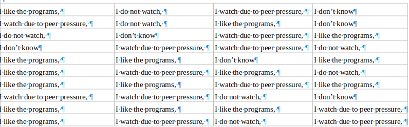
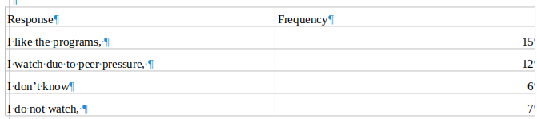
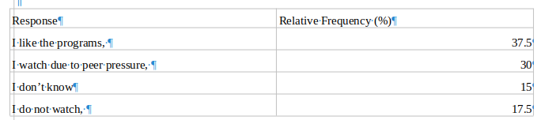
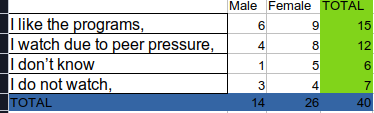

```{r setup, include=FALSE}
knitr::opts_chunk$set(echo = FALSE, message = FALSE, warning = FALSE)
```

## Introduction
- We have already defined categorical data.

- Categorical data falls into two categories: ordinal vs nominal.

- Again, we have seen that to summarise categorical data, we use frequency tables or contigency tables.

- We beriefly review frequency tables.

## Frequency Tables
- A frequency table records the counts for each of the categories of the variable.

- These are the pure frequency tables

- Some tables report percentages. These are RELATIVE frequency tables.

- Many tables also report both counts and percentages.

## Frequency Tables
- Example:

- We asked 40 people whether they watch soap operas on TV because they are interested in the program itself or due to peer pressure.

- There are four answers: I like the programs, I watch die to peer pressure, I do not watch, I don’t know.
;
- The results of the poll are as follows; See the data in the file 

## Frequency Tables



## Frequency Tables



## Frequency Tables: Relative frequency tables

- We convert the counts to percentages to get relative frequency tables



## Visualizing categorical data 

- Two commonly used visualization tools for categorical data are

	- Pie Charts.
	- Bar graphs
	
- Pie charts are less favored given that they use area to represent data.

- The human mind finds it hard to interpret areas (angles).

- The bar chart is easier for the human mind because its a matter of comparing heights. It is linear.

##  Visualizing categorical data: The area principle

- The best data displays observe a fundamental principle of graphing data called the area principle.

- - The area principle states that the area occupied by a part of the graph should correspond to the magnitude of the value it represents.

- That is why, in doing a bar graph, make sure the bars have the same widths. The comparison should only be on height. 

## Visualizing categorical data: The Pie Chart

```{r, echo=FALSE}
library(readxl)
library(tidyverse)
freq_tables <- data.frame(Response = c("I like the programs", "I watch due to peer pressure", 
                                       
                                       "I don’t know", "I do not watch"), Frequency = c(15, 12, 6, 7),
                          
                          Relative_frequency = c(37.5, 30, 15, 17.5))

freq_tables %>% knitr::kable()
```

## Visualizing categorical data: The Pie Chart
```{r}
freq_tables %>% 
  
  ggplot(aes(y = "",
                           
                    x = Frequency, fill = Response)) + 
  
  geom_col() + coord_polar() + 
  
  ggthemes::theme_clean()
```


## Visualizing categorical data: The bar graph

- The x - axis has the categories while the y-axis has the values. 

- As noted, due to the area principle, let the width of the bars be the same so people can compare the heights only. 

- Note that it is easier to interpret the bar chart as compared to the pie chart. 

- When you have many categories, interpreting the pie chart gets even harder. 

- For bar charts its better to arrange the bars in ascending or descending order of height. See examples. 

## Visualizing categorical data: The bar graph

```{r}
freq_tables %>% 
  
  ggplot(aes(x = Response, y = Frequency, fill = Response)) + 
  
  geom_col() + labs(x = "Response", y = "Frequency", title = "Responses on Soap Operas")
```

## Visualizing categorical data: The bar graph (Looks better with order)

```{r}
freq_tables %>% 
  
  ggplot(aes(x = fct_reorder(Response, Frequency, max), y = Frequency, fill = Response)) + 
  
  geom_col() + labs(x = "Response", y = "Frequency", title = "Responses on Soap Operas")
```

## Visualizing categorical data: The bar graph

- Visualizing and summarising data is perhaps one of the most important but under-estimated skill in statistics and data analysis. 

- Before subjecting a dataset to a battery of statistical tests, do the following. 
    
    - Draw a chart.
    
    - Draw a chart.
    
    - Draw a chart. 
    
    - Summarise the data - mean, median, mode, SD, Variance, Quartiles, Extreme values, IQR. 

## Visualizing categorical data: Exercise

- The following dataset shows the responses of individuals in Kenya regarding whether they are generally happy or not.

- Draw a relative frequency table. 

- Draw a pie chart from the relative frequncy table. 

- Draw a bar chart with % on y -axix and responses on the x-axis, arranging the reponses in ascending order of relative frequency (%)

## Visualizing categorical data: Exercise

```{r}
happy_data <- data.frame(Response = c("Very Happy", "Mostly Happy", "Neutral", "Mostly Unhappy", "Unhappy"),
                         
                         Frequency = c(200, 700, 1000, 500, 2000))

happy_data %>% knitr::kable()
```

## Visualizing categorical data: Exercise solutions- relative frequency table

```{r}
happy_data <-  happy_data %>% 
  
  mutate(relative_freq = (Frequency * 100/sum(Frequency)))

happy_data %>% knitr::kable()
```

## Visualizing categorical data: Exercise solutions- pie chart

```{r}
happy_data %>% 
  
  ggplot(aes(y = "", x = relative_freq, fill = Response)) + 
  
  geom_col() + coord_polar() + 
  
  labs(title = "Happiness in Kenya")
```

## Visualizing categorical data: Exercise solutions- Bar chart
```{r}
happy_data %>% 
  
  ggplot(aes(x = fct_reorder(Response, relative_freq, max), y = relative_freq, fill = Response)) + 
  
  geom_col() + labs(x = "Response", y = "Relative Frequency, %", title = "Happiness in Kenya")
```


## Exploring Two Categorical Variables: Contingency Tables

- Sometimes you have two categorical data that you want to summarise together.

- In this case you may use a special type of frequency table called the contigency table.

- The contigency table may present counts or proportions.

- The one with proportions is a relative contigency table.

## Exploring Two Categorical Variables: Contingency Tables

- In the previous example, we add a variable for the sex of the respondents, Female or Male. 

- See the data in excel. 

## Exploring Two Categorical Variables: Contingency Tables

- Here are the first 10 rows of the dataset. 

```{r}
library(readxl)

cont_tables <- read_excel("freq_tables.xlsx", 
    sheet = "cont_data")

head(cont_tables, 10) %>% knitr::kable()
```

## Exploring Two Categorical Variables: Contingency Tables

- A contigency table will break down the data by both variables, comment and sex.

- For instance, how many men said they do not watch the programs.

- How many women watch the programs out of peer pressure. and so on. 

- Again, the summaries can be in the form of counts or percentages. 

## Exploring Two Categorical Variables: Contingency Tables

- Here we go



- The percentages can either be horizontal, by response or vertical, by sex. 

## Exploring Two Categorical Variables: Contingency Tables

```{r}
prop.table(table(cont_tables$Comment, cont_tables$Sex), 1) %>% knitr::kable(caption = "Responses")
```

```{r}
prop.table(table(cont_tables$Comment, cont_tables$Sex), 2) %>% knitr::kable(caption = "Responses")
```


