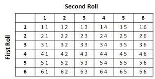

```{r setup, include=FALSE}
knitr::opts_chunk$set(echo = TRUE)
```

## Background
The world is full of random phenomena that we cannot predict individually. For instance, in a pool of customers, it is hard to tell at first glance which one will default. However, given a large dataset over time, we can gain insights into the overall behaviour of customers, including the percentage that default, the characteristics of defaulters, expected losses from defaults and so on. 

>With `random phenomena`, we cannot predict the individual outcomes, but we can hope to understand characteristics of their long-run behavior.

For any random phenomenon, each attempt, or `trial`, generates an `outcome`. We
use the more general term `event` to refer to outcomes or combinations of outcomes. We sometimes talk about the collection of all possible outcomes, a special event
that we will refer to as the `sample space`.

## Example- Tossing a Coin

Suppose you toss a coin once; 

- The toss is the trial. 

- The trial generates an outcome, either a head or tail but NOT both. This is the event where you get either a head or tail. 

- There are two possible outcomes, head ($H$) and Tail ($T$). Hence, the sample space, which is the set of all possible outcomes is $S = {H, T}$. 

## Example 2: Tossing a coin twice

- Each of the two tosses is a trial that generates an outcome. 

- Suppose we get head ($H$) in the first trial and a tail ($T$) in the second trial, then the event in this case is ${H, T}$. This is the combination of outcomes from the two trials. However, it is possible to get different outcomes from different trials. 

- The sample space is the set of all possible outcomes, $S = {HH, HT, TH, TT}$. 

## Exercise
Suppose you roll a six sided fair die once and get a 2. The sides of the die are labelled 1 to 6. 

- What is the trial here? The roll of the die.

- What is the outcome? The 2

- What is the event? The outcome or set of outcomes in this case 2. 

- What is the sample space? $S = {1,2,3,4,5,6}$

## exercise
Suppose you roll a six sided fair die twice and get a 2 in the first, and 6 in the second. The sides of the die are labelled 1 to 6. 

- What are the trials here? Each of the two tosses. 

- What are the outcomes? The 2 and the 6.

- What is the event? The combination of outcomes E = {2, 6}

- What is the sample space? (Hint: Draw a $6 X 6$ grid) and count all possible outcomes. 

- Note that this is similar to having two dice and rolling each of them one time. 

## The sample space for rolling two dice



Notice that the sample space has 36 elements. All these are the possible outcomes. In this case, we just get one of the outcomes {2, 6}. 

## Definitions

### Definition: Model Based (Theoretical) Probability

Model-based Probability We can write:

$P(A) \frac{Number of Outcomes in A}{Total Number of Possible outcomes}$

This is called the (theoretical) probability of the event.

### Definition: Personal Probability

We use the language of probability in everyday speech to express a degree of uncertainty without necessarily basing it on long-run relative frequencies. Your personal assessment of an event expresses your uncertainty about the outcome. We call this kind of probability a subjective, or personal probability.

### Definition: Probability as a Long-Run Frequency

The probability of an event is its long-run relative frequency. As we have seen, a relative frequency is a fraction. For instance, suppose we know that on average, the month of April in Karatina town has 23 rainy days based on meteorological data for the past 50 years. Because April has 30 days, we could write the probability as

$P(Rain in a given day in April) = \frac{long run frequency of Rain}{Total frequency of rain and no rain} = \frac{23}{30}$

### Definition: The Law of Large Numbers

The Law of Large numbers states that the long-run relative frequency of repeated, independent events eventually produces the true relative frequency as the number of trials increases.

For instance, if you observe the number of rainy days in the month of April for may, many years, then you can more accurately estimate the true relative frequency of rainy days for the months of April. 

## The Laws of Probability

### Rule 1: 

If the probability of an event occurring is 0, the event will not occur; likewise
if the probability is 1, the event will always occur. Even if you think an event is very
unlikely, its probability cannot be negative, and even if you are sure it will happen, its probability cannot be greater than 1. So we require that:

A probability is a number between 0 and 1.

For any event A, $0 <= P(A) <= 1$.

### Rule 2: Probability Assignment Rule

If a random phenomenon has only one possible outcome, it is not very interesting (or very random). So we need to distribute the probabilities among all the outcomes a trial can have. How can we do that so that it makes sense? For example, consider the behaviour of a the price of wheat grain in Karatina market. The possible daily outcomes might be:

- A: The stock price goes up.
- B: The stock price goes down.
- C: The stock price remains the same.

Note that A, B, and C form the sample space, S. 

When we assign probabilities to these outcomes, we should be sure to distribute all of the available probability. One of these three events always occurs, so the probability of something happening is 1. This is called the Probability Assignment Rule: The probability of the set of all possible outcomes must be 1. In the case above, 

$P(A) + P(B) + P(C) = P(S) = 1$

Where $S$ is the sample space. 

### Rule 3: The Complement Rule

Suppose the probability that you get to class on time is 0.8. What is the probability that you do not get to class on time? Yes, it is 0.2. The set of outcomes that are not in the event A is called the “complement” of A and is denoted $A^{C}$ . This leads to the Complement Rule:

The probability of an event occurring is 1 minus the probability that it does not occur.

$P(A) = 1 − P(A^{C})$

`Example`: Lee’s Lights sells lighting fixtures. Some customers are there only to browse, so Lee records the behavior of all customers for a week to assess how likely it is that a customer will make a purchase. Lee finds that of 1000 customers entering the store during the week, 300 make purchases. Lee concludes that the probability of a customer making a purchase is 0.30.

If P(purchase) = 0.30, what is the probability that a customer does not make a purchase?

Because “no purchase” is the complement of “purchase,” 

$P(no purchase) = 1 - P(purchase)$

= $1 - 0.30 = 0.70$

There is a 70% chance a customer will not make a purchase.


### Rule 4: The Multiplication Rule 

The Multiplication Rule says that to find the probability that two independent events occur, we multiply the probabilities. For two independent events A and B, the probability that both A and B occur is the product of the probabilities of the two events:

P(A and B) = P(A) * P(B ) , provided that A and B are independent.

Roughly speaking, independence means that the outcome of one trial does not influence or change the outcome of another.

`Example`: Lee knows that the probability that a customer will make a purchase is 30%.

If we can assume that customers behave independently, what is the probability that the next two customers entering Lee’s Lights both make purchases?

P(first customer makes a purchase and second customer makes a purchase)

= $P(purchase1) * P(purchase2)$

= $0.30 * 0.30 = 0.09$

There is about a 9% chance that the next two customers will both make purchases.

### Rule 5: The Addition Rule

The addition Rule allows us to add the probabilities of disjoint events to get the probability that either event occurs:

$P(A or B) = P(A) + P(B)$, 

provided that A and B are disjoint. Disjoint events cannot happen together. For instance, if you toss a coin once, you cannot get a head and a tail. They are also called mutually exclusive events.

`Example`: When you toss a coin once, what is the probability of getting a head or tail. 

We know these are mutually exclusive. 

$P(A or B) = P(A) + P(B) = 0.5 + 0.5 = 1$

Think of it this this way, when you toss a coin once, you will either get a head or tail, each with a probability of 0.5 but at no time will you get both head and tail. 

`Example`: Assume Lees customers can either buy online or physically but not both ways. The probability of online buying is 0.05, while that of physical purchase is 0.3. 

- What is the probability that a customer will buy online OR physically? 

- We know these are mutually exclusive. 

$P(A or B) = P(A) + P(B) = 0.3 + 0.05 = 0.35$

- What is the probability that a customer will not purchase at all?

$P(no purchase) = 1 - P(purchase)$

= $1 - 0.35 = 0.65$

### Rule 6: The General Addition Rule

It turns out that this method works in general. We add the probabilities of two events
and then subtract out the probability of their intersection. This gives us the General
Addition Rule, which does not require disjoint events:

P(A or B) = P(A) + P(B) − P(A and B) for any two events A and B.

`Example:` The chance of Lees customers making a physical purchase is 0.3.

Lee notices that when two customers enter the store together, their purchases are not disjoint. In fact, there’s a 20% chance they’ll both make a purchase. 

When two customers, A and B, enter the store together, what is the probability that at least one of them makes a purchase?

Now we know that the events are not disjoint, so we must use the General Addition Rule.

P(at least one purchases) = P(A purchases or B purchases)

= P(A purchases) + P(B purchases) - P(A and B both purchase)

= 0.30 + 0.30 - 0.20 = 0.40

- The general addition rule is more flexible. 


