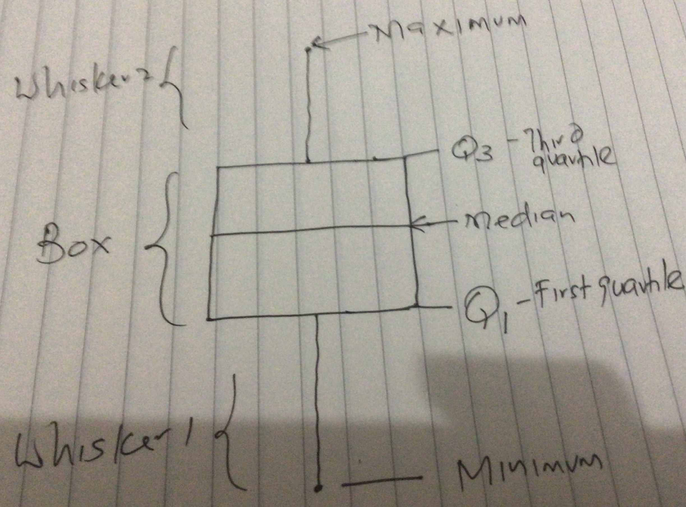

```{r setup, include=FALSE}
knitr::opts_chunk$set(echo = FALSE, warning = FALSE, message = FALSE)

if(!require(c("dslabs", "tidyverse", "kableExtra", "knitr", "skimr", "gghalves"))){
  install.packages(c("dslabs", "tidyverse", "kableExtra", "knitr", "skimr", "gghalves"))
}

options(digits =4)
```

## Background
As noted, frequency tables, relative frequency tables and two way contingency tables provides a useful way of summarising datasets that have one or two categorical variables. A pie chart or bar chart/ column chart are useful for visualizing these data.

When we have quantitative variables only, the best summaries are measures of center and measures of spread. The histogram and density plots (smoothed histograms) are useful in visualizing such data.

At times, you have a dataset that consists of both quantitative and Qualitative variables and want to summarise and visualize the datasets. Here you may employ measures of center and spread for the quantitative variable and frequency tables, relative frequency tables and contingency tables to summarise such datasets. 

A boxplot is one of the useful tools for visualizing such data. Violin plots are a better alternative. 

In this section, we examine how to summarise and visualize a dataset comprising of a quantitative variable and a categorical variable. 

## The data

Let us take a simple dataset of the heights (in Inches) of students in a class and the sex of students. The data comes from the `dslabs` package in `R`. The data represents the self-reported heights of students taking the Bachelors in Data science degree at Harvard University. 

You can access the dataset in R as follows (ensure you are connected to the internet to install the package dslabs if it is not already installed. If dslabs is already available on your computer, you do not need the internet).


```
install.packages("dslabs") #For this you must connect to the internet
library(dslabs) ## Will work without internet
data(heights) ## Will work without internet
```


```{r}
library(dslabs)
library(tidyverse)
data(heights)

head(heights) %>% 
  
  knitr::kable(caption = "Top 6 Observations of Heights vs Sex of a Sample of 
               
               Students", booktabs = TRUE) 
```

```{r}
tail(heights) %>% 
  
  knitr::kable(caption = "Bottom 6 Observations of Heights vs Sex of a Sample of 
               Students", booktabs = TRUE) 
```


## Describining a Dataset
The dataset has `r ncol(heights)` variables and `r nrow(heights)` observations. Sex is a categorical variable with 2 levels, male and female. Height is a continuous quantitative variable with a mean of `r mean(heights$height)` and a median of `r median(heights$height)`. The table below shows further summaries of the data. 

```{r}
heights %>% 
  
  select(sex) %>% 
  
  summary()
```
There are 238 females and 812 males in the dataset. 

```{r}
heights %>% 
  
  select(height) %>% 
  
  summary()
```
## The Quartiles
We have already discussed the mean and the median. The minimum (min) is the smallest number in a range of quantitative variables. The Maximum (max) is the opposite of the minimum. The range is the difference between the minimum and the maximum and is a common measure of spread. The range is however affected a lot by extreme values. What we have not looked at are the quartiles. The median divides the data into two parts, and is usually a single figure. Quartiles, on the other hand divide the dataset into 4 equal parts. Unlike the median which is just one value, there are THREE values for quartiles. 

- Quartile 1 (or 1st Quartile): 

- The median (or the second quartile): 

- Quartile 3 (or 3rd Quartile): 

An easy way to compute the quartiles is as follows. First, get the median. The median will have divided the data into two halves. Note that the median is also the second quartile (quartile connotes a division by 4, so the second quartile is $\frac{2}{4}$ = $\frac{1}{2}$). 

Take the lower half of the data, including the median, and also get its median. That should give you the first quartile. Similarly, take the upper half of the dataset, including the median and compute its median. That is the 3rd quartile.

Let us use a simpler dataset to illustrate this. We shall revisit the heights dataset later. 

## Example

In this illustration, we create a fictitious dataset with 21 observations to illustrate quartiles. Compute the three quartiles for the given data. 

```{r}
set.seed(100, sample.kind = "Rounding")
my_data <- rnorm(21, mean = 50, sd = 5)
my_data
```

The most obvious quartile is the median, the second quartile. remember to get the median and all quartiles in general, the data must be in ascending or descending order. The median is the 11th element- `r median(my_data)`. Mark it!!

```{r}
sort(my_data)
```

Now, we focus on the the data part below the median (remember to also include the median there). The median of that lower part is 48.05573. This is the 1st quartile. 

```{r}
quantile(my_data, probs = 0.25)
```
Now we focus on the upper portion of the dataset, again including the median. The median of the upper part is 51.59315.

```{r}
quantile(my_data, probs = 0.75)
```
Example
Get the quartiles and draw a boxplot
```{r}
my_data1 <- c(14, 21, 23, 29, 2, 1, 4, 5, 11, 15, 12) 
```

## Percentile

The first quartile (which we may write as $\frac{1}{4}$ is equivalent to the 25th percentile or $\frac{25}{100} = \frac{1}{4}$). 

The median is the 50th percentile $\frac{50}{100} = \frac{1}{2}$. 

The 3rd quartile is the 75th percentile $\frac{75}{100} = \frac{3}{4}$. 

While quartiles divide the data into 4 equal parts, percentiles divide the dataset into 100 equal parts. 

## The Box plot.

The boxplot presents a five number summary in a plot. The summaries presented in a boxplot are the minimum, the maximum, the median, the first quartile and the third quartile. Note that the mean is not included here- why? It is considered not robust to extreme values or outliers. 

The 1st quartile, median and third quartile are captured using a box. The maximum and minimum are captured using whiskers. The box plot is also called a box and whiskers plot as a result. The figure below serves to illustrate this point. 

\blandscape



\elandscape
Now let us draw the boxplot for the data above

```{r}
my_data %>% 
  
  tibble() %>% 
  
  ggplot(aes(x = "", y = .)) + 
  
  geom_boxplot() + 
  
  ggthemes::theme_clean()
```

Note that in this case the maximum is represented outside the whiskers as a dot, meaning that it is an outlier. When an observation is too large or too small relative to other observations, it is presented separately as a dot. We shall not delve into outliers here, the box and whisker should do for us. 

Now that we know what a box plot is, lets go back to our heights dataset. 

## Back to the Heights dataset

How well can we visualize this data? A box plot is a good choice given that it gives us five measures- minimum, Q1, median, Q3 and the maximum. 

However, the boxplot tells us little about the distribution of the data or the shape. In this case, we could draw two boxplots side by side, one for males and one for females as follows. 

1. Separate the data into males and females. 
2. Arrange each of the two datasets in ascending or descending order. 
3. Determine the minimum, Q1, median, Q3, and the maximum for each set of data; remember we now have two datasets male and female. 
4. Draw the boxplots side by side with the x-axis representing sex (female versus male) and the y-axis representing the values above. 

Below are summary statistics for the male and female datasets. 

```{r}
heights %>% 
  
  group_by(sex) %>% 
  
  skimr::skim_without_charts() %>% 
  
  select(-skim_type, -n_missing, -complete_rate) %>% 
  
  rename(Variable = skim_variable, Sex = sex, 
         
         Mean = numeric.mean, SD = numeric.sd, 
         
         Minimum = numeric.p0, Q1 = numeric.p25, 
         
         Median = numeric.p50, Q3 = numeric.p75, 
         
         Maximum = numeric.p100) %>% 
  
  knitr::kable(booktabs = TRUE, 
               
  caption = "Summary Statistics for Females and Males in the Heights Dataset") %>% kableExtra::kable_styling(full_width = TRUE, bootstrap_options = "striped") %>% 
  
  kableExtra::add_footnote("Note that in all cases, males are on average taller than females. However, this does not mean that ALL males are taller than females as the chart on the next page shows.", notation = "symbol")
```


- Your sketch should be similar to this. 

\newpage
\blandscape

```{r, fig.height = 8, fig.width = 12}
heights %>% 
  
  ggplot(aes(x = sex, y = height, col = sex)) + 
  
  geom_boxplot(show.legend = FALSE) + 
  
  labs(x = "Sex", y = "Height", title = "Height of Students by Sex", 
       
       caption = "Source: Constructed by John Karuitha, 2021 using ggplot2 and the dslabs heights dataset in R") + 
  
  ggthemes::theme_economist()
```

\elandscape
\newpage

## Interpreting the boxplots above

The interpretation could be something like this;

- Not all women are shorter than men. 
- Not all men are taller than women.
- On average, men tend to be taller than women. Look at the median heights for men and women.
- The height data in this case has extreme values, that is, females and males who are extremely tall and extremely short than the average. 

## The Violin Plot

As noted earlier, the boxplot hides the distribution of the data. An improved version of a boxplot is the violin plot that combines histograms with the boxplot concept. While the violin plot is not examinable, it is useful to know it for your future research requirements. Turning the violin plot on its side gives you the density plots (smoothed histograms) for the dataset while retaining all the information contained in the boxplot. 
 
 
\newpage
\blandscape
 
```{r, fig.height = 8, fig.width = 10}
library(gghalves)

heights %>% 
  
  ggplot(aes(x = sex, y = height, col = sex)) + 
  
  geom_half_violin(show.legend = FALSE, draw_quantiles = c(0.25, 0.5, 0.75)) + 
  
  labs(x = "Sex", y = "Height", title = "Height of Students by Sex", 
       
       caption = "Source: Constructed by John Karuitha, 2021 using ggplot2 and the dslabs heights dataset in R") + 
  
  ggthemes::theme_economist()
```

\elandscape
\newpage


## Exercise

The dataset below shows the body mass index for two categories of people; those that exercise often versus those who do not exercise at all. 

```{r}
set.seed(200, sample.kind = "Rounding")
exercise <- c(rnorm(20, mean = 20, sd = 1), rnorm(21, mean = 25, sd = 3))

bmi_data <- tibble(status = c(rep("exercise", 20), rep("no_exercise", 21)), 
                   
                   bmi = exercise)

bmi_data %>% 
  
  knitr::kable(booktabs = TRUE, caption = "Effects of Exercise on BMI") %>% 
  
  kableExtra::kable_styling(bootstrap_options = "striped", 
                            
                            font_size = 10, full_width = TRUE) %>% 
  kableExtra::add_footnote("source: Authors construction", notation = "symbol")
```
\newpage

**REQUIRED**

- Assume the data is not stratified into exercise versus no exercise, draw a box plot for the entire dataset. 

- Divide the data into 2 groups of exercise versus no_exercise and draw the boxplots for both groups side by side. note that in this case, x will be the status, exercise vs no exercise, while y is the BMI. 

- Based on the plot, describe the effects of exercise on BMI. 
